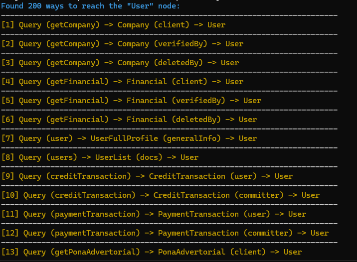
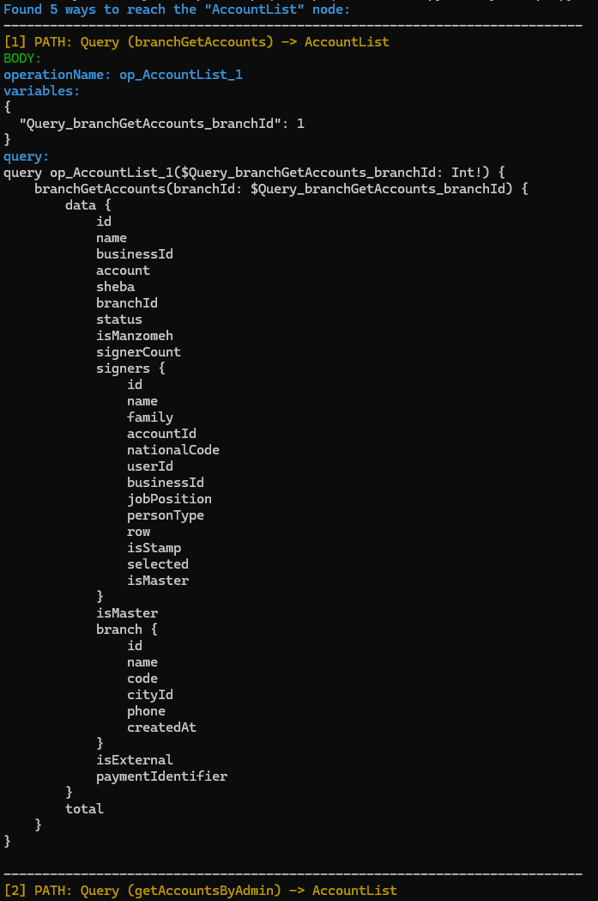

# 🧭 GraphQL Path Query Builder

GraphQL Path Query Builder is a CLI utility that takes a **standard GraphQL introspection schema** (`Schema.json`) and generates **Burp-ready request bodies** for **every reachable path** that leads to a target `type/object`.

It is built for practical security testing and schema exploration workflows where you want to answer questions like:

- “Can I reach a sensitive object (e.g., `Account`, `User`, `Admin`, `Payment`) through *any* query path?”
- “Is there an indirect path that exposes fields I can’t access directly?”
- “What are all traversal chains from `Query` to a given object, including nested objects and list containers?”
- “Can I quickly generate editable GraphQL payloads for Burp Repeater without hand-writing queries?”

This tool focuses on producing output that is:
- **Comprehensive**: enumerates all discoverable paths from the root type to the target type.
- **Fast**: designed to work on large real-world schemas efficiently.
- **Burp-friendly**: outputs full JSON request bodies that you can paste directly into Burp Suite Repeater, and optionally stores them as NDJSON for quick reuse.
- **Readable**: prints pretty, multi-line GraphQL queries in the console (so you do not see `\n`) while keeping the saved file JSON-valid.

Typical use cases:
- **Authorization testing / BOLA (IDOR-like) exploration** in GraphQL by checking all ways to reach a sensitive object.
- **Hidden data discovery**: find alternate query paths that reveal extra fields or bypass UI constraints.
- **Attack surface mapping**: enumerate entrypoints that lead to a particular object through complex response graphs.
- **Burp workflow automation**: generate test payloads quickly and iterate in Burp’s GraphQL tab.

> Important: This tool is **schema-structure-based**. A path existing in the schema does not guarantee you are authorized to access it at runtime. It simply shows what is possible structurally and generates payload templates you can test.

---

## ✨ Features

- 📦 Parse standard introspection JSON (`data.__schema` or `__schema`)
- 🧵 Discover **all paths** from root (default `Query`) to a target type
- 🧱 Generate GraphQL request bodies with:
  - `operationName`
  - `variables` (placeholders) or inline literals
  - Multi-line pretty queries (console readable; file remains JSON-valid)
- 🧾 Output modes:
  - **Pretty console** (multi-line query, no `\n` shown)
  - **Burp copy** mode (single-line JSON per path)
  - **Paths-only** mode
- 💾 Output to file:
  - **NDJSON** (default): one JSON per line (ideal for Burp workflow)
  - JSON array
- 🧯 Large-output handling:
  - `--console-log` to avoid terminal truncation (Windows CMD buffer issues)

---

## 🧰 Requirements

- 🐍 Python 3.9+
- 🎨 Optional colored output:
  - `colorama`

Install:
```bash
pip install -r requirements.txt
```

---

## 🚀 Quick Start

### 1) Generate Burp-ready bodies (file + readable console)
```bash
python gql_path_query_builder.py -s Schema.json -t User -o user.ndjson
```

### 2) Copy/paste each path result directly into Burp (single-line JSON)
```bash
python gql_path_query_builder.py -s Schema.json -t Account -m burp
```

### 3) Show both: readable multi-line query + a single-line Burp body line
```bash
python gql_path_query_builder.py -s Schema.json -t Account -m burp_pretty
```

### 4) Only list the discovered paths (no queries generated)
```bash
python gql_path_query_builder.py -s Schema.json -t Account -p
```

### 5) Bundle all paths into one query (aliases p1, p2, ...)
Useful when you want a single request to test multiple access paths.
```bash
python gql_path_query_builder.py -s Schema.json -t User -b -o user_bundled.ndjson
```

---

## 🖼️ Screenshots


### 1) Example of Paths-only output


### 2) Example of Path + generated query output


> Tip: Keep screenshots readable by using `-m pretty` (default) for multi-line query display.

---

## 🧪 Burp Suite workflow (recommended)

### Option A — Console copy mode
1. Run:
   ```bash
   python gql_path_query_builder.py -s Schema.json -t Account -m burp
   ```
2. For each printed path:
   - Copy the JSON line printed under **BURP BODY**
3. Paste into Burp Repeater request body.
4. Open the **GraphQL tab** and edit fields/variables easily.

### Option B — NDJSON file
1. Generate a file:
   ```bash
   python gql_path_query_builder.py -s Schema.json -t Account -o account.ndjson
   ```
2. Open `account.ndjson` and copy any single line into Burp.

---

## 🖥️ Console output modes

- `-m pretty` (default):
  - Multi-line query is printed as real new lines (no `\n` shown)
- `-m burp`:
  - Prints a single-line JSON body per path (easy paste into Burp)
- `-m burp_pretty`:
  - Prints readable multi-line query + also prints a single-line Burp body line

Examples:
```bash
python gql_path_query_builder.py -s Schema.json -t User -m pretty
python gql_path_query_builder.py -s Schema.json -t User -m burp
python gql_path_query_builder.py -s Schema.json -t User -m burp_pretty
```

---

## 🧯 Handling large outputs (Windows CMD / terminal buffer)

When the number of paths is large, terminals may truncate older lines.
Use `--console-log` to save **full console output** to a file:

```bash
python gql_path_query_builder.py -s Schema.json -t Account -m burp -L console_output.txt
```

You can then copy from the file safely.

---

## ⚙️ CLI Options

### Required
- `-s, --schema` : Path to introspection JSON (`Schema.json`)
- `-t, --target` : Target type name (e.g. `User`, `Account`)

### Common
- `-r, --root` : Root type (default: `Query`)
- `-o, --out` : Output file path (optional)
- `-f, --format` : `ndjson` (default) or `json-array`
- `-p, --paths-only` : Only show paths
- `-b, --bundle-aliases` : Bundle paths into one query with aliases

### Path discovery limits
- `-D, --max-path-depth` : Max traversal depth (default: 8)
- `-M, --max-paths` : Max number of paths to return (default: 200)

### Query/selection limits
- `-d, --selection-depth` : Selection depth (default: 4)
- `-F, --max-fields-per-type` : Max fields per type (default: 30)
- `-T, --max-total-fields` : Global field cap (default: 500)
- `-c, --cycle-policy` : `scalars` (default) / `typename` / `stop`

### Arguments & variables
- `-a, --arg-mode` : `vars` (default) or `inline`
- `-R, --include-required-args-fields` : include fields that require args in selections
- `-O, --include-optional-args` : include optional args too
- `-I, --max-input-depth` : InputObject placeholder depth (default: 4)

### Formatting & console
- `-m, --console-mode` : `pretty` (default) | `burp` | `burp_pretty`
- `-Q, --no-pretty-query` : disable pretty query formatting
- `-i, --indent` : indent size for pretty query (default: 4)
- `-L, --console-log` : save full console output to a text file
- `-n, --no-console` : disable console output
- `-C, --no-color` : disable color output

---

## 🧷 Examples

### Generate all paths to `Account`, save to NDJSON
```bash
python gql_path_query_builder.py -s Schema.json -t Account -o account.ndjson
```

### Restrict output count to 50 paths
```bash
python gql_path_query_builder.py -s Schema.json -t Account -M 50 -o account_50.ndjson
```

### Use inline args instead of variables
```bash
python gql_path_query_builder.py -s Schema.json -t Account -a inline -O
```

---

## 🧩 Notes / Limitations

- This tool uses schema structure only (no runtime authorization checks). A path existing in the schema does not guarantee access.
- Very large schemas can produce many paths; use `--max-paths` and `--max-path-depth` to control output.

---

## 🗺️ Roadmap

- Burp Suite Extension (Montoya API) integration
- Optional pruning/dedup strategies for extremely large schemas
- Built-in schema validation hints & statistics

---

## ⚠️ Disclaimer

This tool is intended for authorized security testing and internal schema analysis only.
